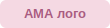

# Инструкция: ваш сайт AMA на чистом HTML/CSS

Привет! Это пошаговая инструкция для человека, который **первый раз** делает сайт руками. Никакого опыта программирования не нужно — просто следуйте шагам по порядку.

---

## Что у вас в архиве

```
ama-site/
├── index.html              ← Главная страница
├── brendy.html              ← Страница "Бренды"
├── sotrudnichestvo.html      ← Страница "Сотрудничество"
├── kontakty.html              ← Страница "Контакты"
├── css/
│   └── style.css            ← Все стили (цвета, шрифты, отступы)
├── js/
│   └── script.js            ← Логика: меню, музыка, лепестки, кнопка "наверх"
├── images/
│   └── logo-placeholder.svg  ← Временный логотип-заглушка
└── fonts/                   ← Сюда положить шрифт, если он у вас есть
```

Каждый `.html` файл — это отдельная страница сайта. Открой любой из них двойным кликом — он откроется в браузере, и вы сразу увидите сайт.

---

## Шаг 1. Посмотрите, что получилось

1. Найдите папку `ama-site` на компьютере.
2. Дважды кликните на `index.html`.
3. Он откроется в браузере (Chrome, Edge, Safari — любой). Вот так выглядит ваш сайт прямо сейчас, без правок.

Вы увидите розовые блоки с пунктирной рамкой и подписью вида **"СЮДА: фото..."** — это места под ваши будущие картинки. Так и должно быть на этом этапе.

---

## Шаг 2. Замените картинки

Это самая частая правка, поэтому разберём подробно.

### Где какие картинки нужны

| Файл картинки | Где используется | Рекомендуемый размер |
|---|---|---|
| `images/logo.png` | Логотип в шапке сайта | высота ~28px, прозрачный фон (PNG) |
| `images/hero-bg.jpg` | Фон главного баннера | примерно 1920×1000px |
| `images/brand-graymelin.jpg` | Карточка бренда Graymelin | примерно 800×600px |
| `images/brand-verobene.jpg` | Карточка бренда Verobene | примерно 800×600px |
| `images/brand-ecopure.jpg` | Карточка бренда Ecopure | примерно 800×600px |
| `images/brand-ama.jpg` | Карточка бренда AMA Cosmetic | примерно 800×600px |
| `images/brand-rosee.jpg` | Фото бренда Rosée (страница "Бренды") | примерно 800×600px |
| `images/about-1.jpg`, `images/about-2.jpg` | Фото в блоке "О нас" | примерно 600×800px (вертикальные) |

### Как вставить картинку

1. Положите файл картинки в папку `images/` (просто скопируйте туда файл с компьютера).
2. **Назовите его ровно так**, как написано в таблице выше (например, `logo.png`). Это важно — если назвать иначе, картинка не появится.
3. Откройте нужный `.html` файл **в Блокноте** (правый клик → "Открыть с помощью" → "Блокнот", или используйте бесплатную программу [VS Code](https://code.visualstudio.com/), это удобнее).
4. Найдите нужную строку. Например, для логотипа в `index.html` ищите:
   ```html
   
   ```
   Замените на:
   ```html
   
   ```
5. Для фоновой картинки баннера откройте `css/style.css`, найдите блок `.ama-hero-bg` и поменяйте класс в HTML: в `index.html` найдите
   ```html
   <div class="ama-hero-bg placeholder"></div>
   ```
   и уберите слово `placeholder`, должно стать:
   ```html
   <div class="ama-hero-bg"></div>
   ```
   (Слово `placeholder` — это то, что показывает розовую заглушку с подписью. Убрав его, вы включаете настоящую картинку `hero-bg.jpg`.)

6. Для карточек брендов на главной странице найдите в `index.html`:
   ```html
   <div class="brand-card placeholder">СЮДА: фото Graymelin (images/brand-graymelin.jpg)</div>
   ```
   Замените на:
   ```html
   <div class="brand-card"></div>
   ```
   То же самое сделайте для остальных трёх карточек ниже.

7. Сохраните файл (Ctrl+S) и обновите страницу в браузере (F5) — увидите результат.

**Совет:** меняйте по одной картинке за раз и сразу проверяйте в браузере — так проще понять, что где находится.

---

## Шаг 3. Поменяйте тексты

Открывайте `.html` файл в Блокноте/VS Code, ищите нужный текст обычным поиском (Ctrl+F) и меняйте прямо между тегами. Например:

```html
<h2>О нас</h2>
<p>AMA — оптовый поставщик корейской косметики...</p>
```

Меняете текст внутри `<p>...</p>` на свой — остальное (теги `<p>`, `</p>`) не трогаете, иначе может сломаться вёрстка.

---

## Шаг 4. Поменяйте контакты

Контакты повторяются в нескольких местах (шапка, подвал, страница "Контакты"). Используйте поиск (Ctrl+F) по всем файлам на:
- `apexscorp@gmail.com` — email
- `821036293163` — номер WhatsApp (в формате без + и пробелов)
- `+82-31-998-6675` — телефон
- `Gimpo-si` — адрес

Замените на свои данные **во всех файлах**, где встречается (в каждом `.html` есть одинаковый подвал).

---

## Шаг 5. Музыка (если хотите оставить плеер рабочим)

В коде уже есть плеер с 5 треками в углу шапки. Чтобы он реально проигрывал музыку:

1. Положите 5 `.mp3` файлов в папку `images/audio/`.
2. Названия файлов должны совпадать с тем, что указано в `js/script.js` (в начале файла, переменная `amaPlaylist`):
   ```
   images/audio/awakening.mp3
   images/audio/Falling_Into_The_Sky_1_1.mp3
   images/audio/Higher_Than_Before_1.mp3
   images/audio/Falling_Into_The_Sky_2.mp3
   images/audio/Into_The_Horizon_1.mp3
   ```
   Либо переименуйте свои файлы под эти названия, либо измените названия в `script.js` под свои файлы.

Если музыки нет — ничего страшного, кнопка просто не будет ничего проигрывать, на вид сайта это не повлияет.

---

## Шаг 6. Как опубликовать сайт (сделать доступным всем в интернете)

Сейчас сайт открывается только у вас на компьютере. Чтобы его увидели другие люди по адресу `korcosama.com`, нужен **хостинг** — место в интернете, куда загружаются файлы сайта.

Раз домен `korcosama.com` уже существует — скорее всего, хостинг тоже уже есть (просто доступ к Joomla-админке сейчас недоступен). Варианты:

1. **Если вернёте доступ к старому хостингу** — зайдите в файловый менеджер хостинга (обычно называется cPanel, ISPmanager, или просто "Файлы" в личном кабинете), удалите старые Joomla-файлы из папки сайта (или сделайте их резервную копию) и загрузите туда все файлы из папки `ama-site` (содержимое, не саму папку).

2. **Если хотите попробовать на новом/бесплатном хостинге для теста** — есть бесплатные варианты, например Netlify или GitHub Pages, куда можно перетащить папку `ama-site` мышкой, и сайт сразу станет доступен по временной ссылке. Это хороший способ потренироваться, прежде чем переносить на основной домен.

Если дойдёте до этого шага и понадобится помощь с публикацией — пишите, разберём вместе.

---

## Частые вопросы

**Я что-то сломал(а), сайт перестал выглядеть нормально — что делать?**
Откройте файл заново в Блокноте и сравните со скриншотом/резервной копией. Лучше всего — перед правками сделайте копию всей папки `ama-site` (просто Ctrl+C, Ctrl+V), чтобы всегда можно было откатиться назад.

**Можно ли добавить ещё одну страницу?**
Да — скопируйте `kontakty.html`, переименуйте копию (например, `dostavka.html`), поменяйте контент внутри. Не забудьте добавить на неё ссылку в меню (в блоке `<ul class="ama-menu-center">` в каждом файле).

**Где менять цвет розового акцента?**
В `css/style.css` ищите `#d13e74` (это основной розовый цвет кнопок) — это можно заменить на любой другой код цвета.

---

Если что-то не получается на любом шаге — просто пришлите скриншот или опишите, что видите, и что должно быть — разберёмся вместе.
